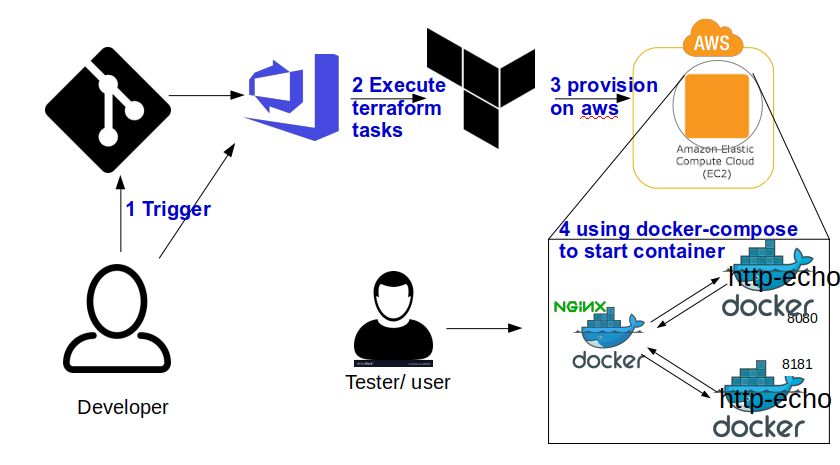

Continuous Deployment of sample application to aws using VSTS and Terraform
============

In this repo are files needed by vsts to provision an aws instance then initilise it by starting a docker-compose up.

The image shows the flow. 
1. A developer triggers the pipeline with either a commit to git to this repo (no yet enbled) or directly on vsts. 
2. Starts pipeline in vsts which invokes terraform.
3. Terraform jobs provision aws instance
4. Docker-compose installs and starts 2 instances (docker containers) of  [http-echo](https://github.com/hashicorp/http-echo) with an NGINX load balancers

[VSTS link](https://dev.azure.com/abdulbasitkay/http-echo/_apps/hub/ms.vss-releaseManagement-web.cd-release-progress?_a=release-pipeline-progress&releaseId=62) : https://dev.azure.com/abdulbasitkay/http-echo/_apps/hub/ms.vss-releaseManagement-web.cd-release-progress?_a=release-pipeline-progress&releaseId=62

## test
Test would be done manually by a user by visiting on a web browser the aws domain as can be found in the logs of the ferraform job. The fist instnace of the app (http-echo) is on port 8080 (example ec2-xx-xx-xx-xxx.us-west-2.compute.amazonaws.com:8080) and the second is on 8181 (example ec2-xx-xx-xx-xxx.us-west-2.compute.amazonaws.com:8181). the load balanced app is on port 80 (example ec2-xx-xx-xx-xxx.us-west-2.compute.amazonaws.com:80)

## Improvements
1. automated test
2. persist terraform state file arrors multiple releases
3. use ansible to configure instances
4. add git trigger for the release.
